# School Management — DevOps Demo

A small **Django + Django REST Framework** CRUD API for *students*, built to
demonstrate a complete DevOps workflow: containerization → CI with security
scanning → image registry → GitOps deployment to **Azure Kubernetes Service
(AKS)** → observability → an HTTPS Flutter web frontend.

The application itself is intentionally simple. The value is in everything around
it — the pipeline, the Kubernetes manifests, GitOps with Argo CD, TLS, and
monitoring.

---

## Architecture

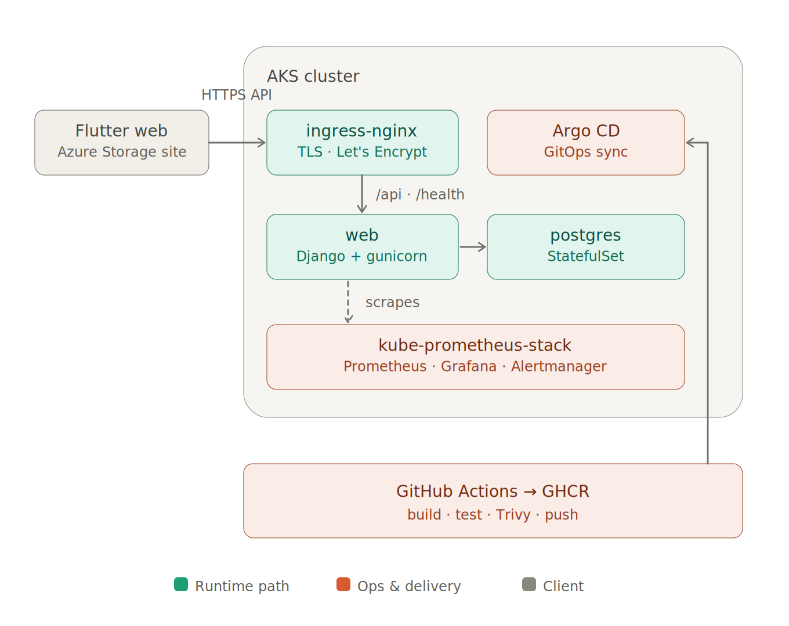

---

## Tech stack

| Layer | Choice |
|---|---|
| Language / runtime | Python 3.12, dependency mgmt via **uv** (`pyproject.toml` + `uv.lock`) |
| Web | **Django 6** + **Django REST Framework**, **gunicorn**, **WhiteNoise** |
| Database | **PostgreSQL 18** via **psycopg3** (`psycopg[binary]`) |
| CORS | `django-cors-headers` (env-driven allowlist) |
| Container | **Docker**, `python:3.12-alpine`, non-root user |
| CI/CD | **GitHub Actions** → **GHCR**, image scanned with **Trivy** |
| Orchestration | **Kubernetes** (Kustomize), local **minikube** + **AKS** |
| GitOps | **Argo CD** |
| TLS | **cert-manager** + **Let's Encrypt** (HTTP-01), `nip.io` hostname |
| Observability | **kube-prometheus-stack** (Prometheus + Grafana + Alertmanager) |
| Frontend | **Flutter web**, hosted on **Azure Storage static website** |

---

## Repository layout

```
core/                       Django project (settings, urls, wsgi, health view)
students/                   the app — model, serializer, views, urls, tests
Dockerfile                  python:3.12-alpine, uv install, collectstatic, gunicorn
docker-compose.yml          web + db (postgres:18-alpine) for local dev
.github/workflows/ci.yml    build → test → Trivy scan → push to GHCR
deploy/
  base/                     Kustomize base (runs on minikube AND AKS)
    namespace, configmap, postgres-statefulset/service,
    web-deployment/service, ingress, kustomization
  overlays/aks/             AKS overrides (managed-csi storage, image tag)
  argocd/
    application.yaml         Argo CD App for local/minikube (base)
    application-aks.yaml     Argo CD App for AKS (main + overlays/aks)
    monitoring.yaml          Argo CD App: kube-prometheus-stack (Helm)
scripts/
  monitoring-up.sh          install/verify the monitoring stack via Argo CD
```

---

## API

Base path `/api/`. All collection/detail URLs require a **trailing slash**.

| Operation | Method | URL |
|---|---|---|
| List | GET | `/api/students/` |
| Create | POST | `/api/students/` |
| Retrieve | GET | `/api/students/<id>/` |
| Update | PUT / PATCH | `/api/students/<id>/` |
| Delete | DELETE | `/api/students/<id>/` |

Plus `/health/` → `{"status":"ok","database":"up"}` (200, or 503 if the DB is
down) and Django admin at `/admin/`.

**Student fields:** `first_name`, `last_name`, `email` (unique),
`enrollment_number` (unique), `date_of_birth` (optional), `created_at`,
`updated_at`.

---

## Local development

```bash
cp .env.example .env          # fill in SECRET_KEY, Postgres creds, etc.
docker compose up -d --build
curl http://localhost/health/  # → {"status":"ok","database":"up"}
```

`web` is published on `80:8000`; `db` (postgres:18-alpine) is **not** exposed to
the host. The Postgres volume mounts at `/var/lib/postgresql` (PG18 layout — not
`/var/lib/postgresql/data`).

### Tests

```bash
python manage.py test          # or inside the built image, as CI does
```

---

## CI/CD — GitHub Actions → GHCR

Triggered on **push to `main`** ([.github/workflows/ci.yml](.github/workflows/ci.yml)):

1. **Build** the web image (loaded locally for test/scan, not yet pushed).
2. **Test** — run `python manage.py test` inside the built image against a
   Postgres service container.
3. **Trivy scan** — `HIGH,CRITICAL`, `exit-code: 1` → a vulnerable image never
   ships. Only the app image is gated.
4. **Push** to **GHCR** (`ghcr.io/<owner>/<repo>`), tags `latest` + commit SHA,
   authenticated with the built-in `GITHUB_TOKEN`.

Image-size note: the Alpine base + psycopg3 keeps the app image at **0
HIGH/CRITICAL** findings.

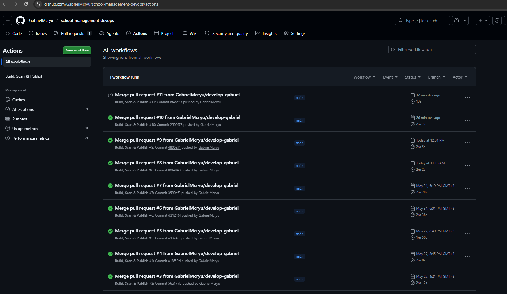
*GitHub Actions — build/scan/publish runs.*

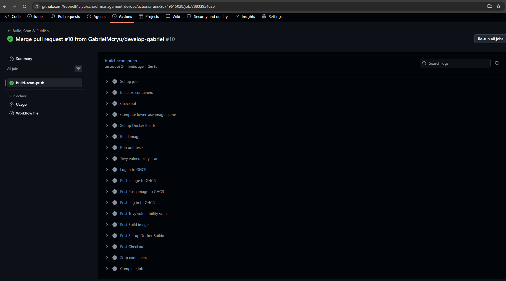
*The `build-scan-push` job: build → unit tests → Trivy scan → push to GHCR, all green.*

---

## Kubernetes deployment

Manifests are **Kustomize**-based. The `base/` runs unchanged on minikube and
AKS; the `overlays/aks/` overlay swaps the Postgres PVC to the `managed-csi`
storage class and pins the image tag.

### Secrets (created out-of-band, never in Git)

The `school-secrets` Secret holds **only** genuinely-secret keys
(`SECRET_KEY`, `POSTGRES_DB`, `POSTGRES_USER`, `POSTGRES_PASSWORD`). Connection
routing (`POSTGRES_HOST=postgres`, etc.) lives in the ConfigMap.

```bash
grep -E '^(SECRET_KEY|POSTGRES_DB|POSTGRES_USER|POSTGRES_PASSWORD)=' .env > /tmp/secrets.env
kubectl create namespace school
kubectl create secret generic school-secrets -n school --from-env-file=/tmp/secrets.env
rm /tmp/secrets.env
```

### Local (minikube)

```bash
minikube start --profile school --cpus 2 --memory 4096
minikube addons enable ingress --profile school
minikube image load ghcr.io/<owner>/school-management-devops:latest --profile school
kubectl apply -k deploy/base
```

### AKS (production)

> Note: on a fresh subscription, pick a node SKU from a VM family that has vCPU
> quota in your region (e.g. `Standard_D2s_v3`). `az vm list-usage -l <region>`
> shows availability.

```bash
az group create -n school-demo-rg -l eastus
az aks create -g school-demo-rg -n school-demo \
  --tier free --node-count 1 --node-vm-size Standard_D2s_v3 \
  --node-osdisk-type Managed --node-osdisk-size 30 --generate-ssh-keys
az aks get-credentials -g school-demo-rg -n school-demo
```

Then install the cluster components (out-of-band, like Argo CD itself):

```bash
# ingress controller (registers the `nginx` IngressClass + a Standard LB/IP)
kubectl apply -f https://raw.githubusercontent.com/kubernetes/ingress-nginx/controller-v1.15.1/deploy/static/provider/cloud/deploy.yaml

# secret bootstrap (see above), then Argo CD
kubectl create namespace argocd
kubectl apply -n argocd --server-side --force-conflicts \
  -f https://raw.githubusercontent.com/argoproj/argo-cd/v3.4.3/manifests/install.yaml
```

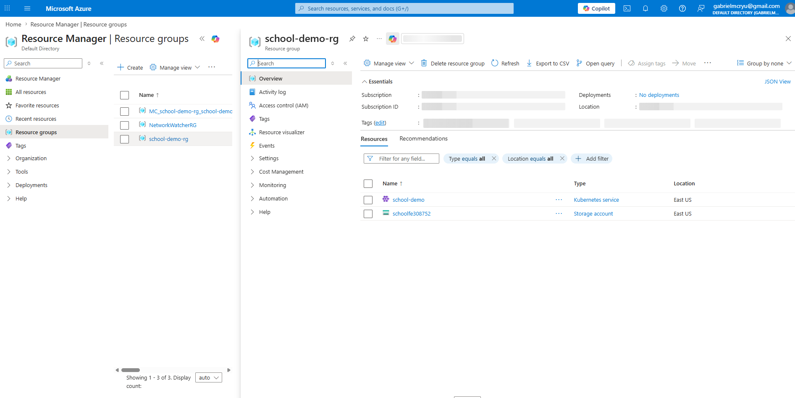
*The `school-demo-rg` resource group — the AKS cluster + frontend storage account.*

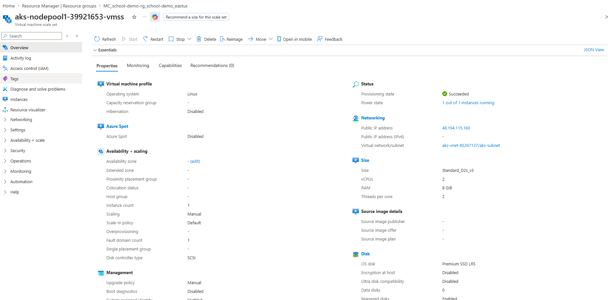
*The AKS node: `Standard_D2s_v3` (2 vCPU / 8 GB), Linux, with the LoadBalancer public IP.*

---

## GitOps with Argo CD

Argo CD watches Git and syncs the cluster to match.

- **AKS:** [deploy/argocd/application-aks.yaml](deploy/argocd/application-aks.yaml)
  tracks `main` + `deploy/overlays/aks`.
- **Local/minikube:** [deploy/argocd/application.yaml](deploy/argocd/application.yaml)
  tracks a working branch + `deploy/base`.

```bash
kubectl apply -f deploy/argocd/application-aks.yaml
# UI:
kubectl port-forward svc/argocd-server -n argocd 8080:443
kubectl -n argocd get secret argocd-initial-admin-secret \
  -o jsonpath='{.data.password}' | base64 -d
```

**Image rollout:** the deployment pins a tag, so a new `:latest` push does not
auto-redeploy. Bump `deploy/overlays/aks/kustomization.yaml` `newTag` to the new
commit SHA (CI publishes a SHA-tagged image) and push — Argo CD then rolls the
new image out.

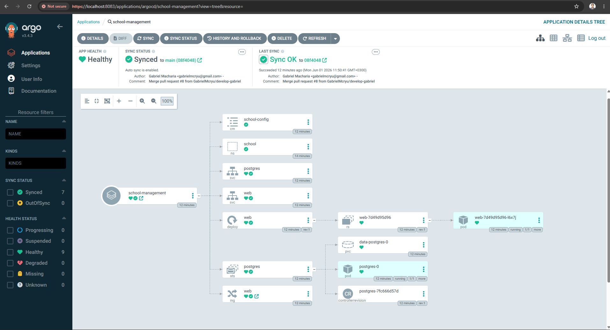
*Argo CD: the `school-management` app **Synced + Healthy**, showing the full resource tree (Deployment, StatefulSet, Services, Ingress).*

---

## HTTPS (cert-manager + Let's Encrypt)

The backend is reached over a real, browser-trusted TLS cert without owning a
domain, using a `nip.io` hostname that resolves the LoadBalancer IP.

```bash
# cert-manager
kubectl apply -f https://github.com/cert-manager/cert-manager/releases/latest/download/cert-manager.yaml
# Let's Encrypt production ClusterIssuer (HTTP-01 via nginx) — see deploy/ docs
```

The Ingress carries the `<LB-IP>.nip.io` host, a
`cert-manager.io/cluster-issuer` annotation, and a `tls:` block; cert-manager
issues the cert into the `web-tls` secret automatically.

> Because the host embeds the LoadBalancer IP, recreating the cluster (new IP)
> means updating the Ingress host and the frontend's API URL to the new
> `<new-IP>.nip.io`.

---

## Monitoring (Prometheus + Grafana)

Installed declaratively via Argo CD + the **kube-prometheus-stack** Helm chart
([deploy/argocd/monitoring.yaml](deploy/argocd/monitoring.yaml)):

```bash
./scripts/monitoring-up.sh        # applies the Application + verifies sync
kubectl port-forward -n monitoring svc/monitoring-grafana 3000:80   # admin/admin
```

Bundles Prometheus, Grafana (preloaded cluster dashboards), Alertmanager,
node-exporter, and kube-state-metrics. Values are trimmed for a single small
node (short retention, ephemeral storage, capped resources).

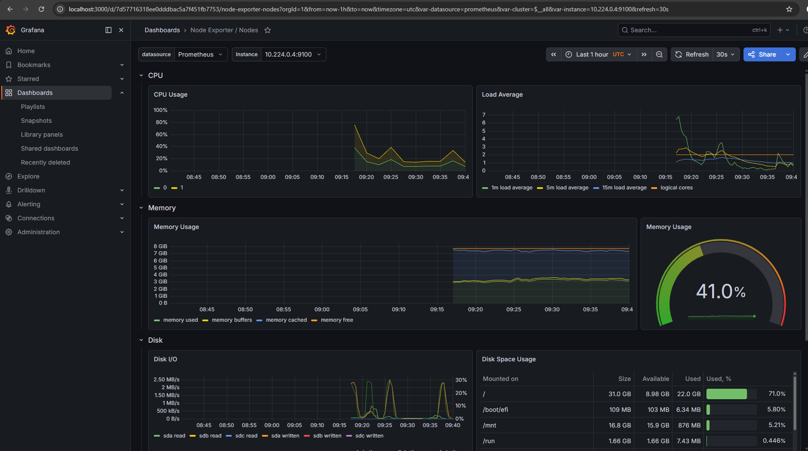
*Grafana — Node Exporter / Nodes: node CPU, memory, disk, and network.*

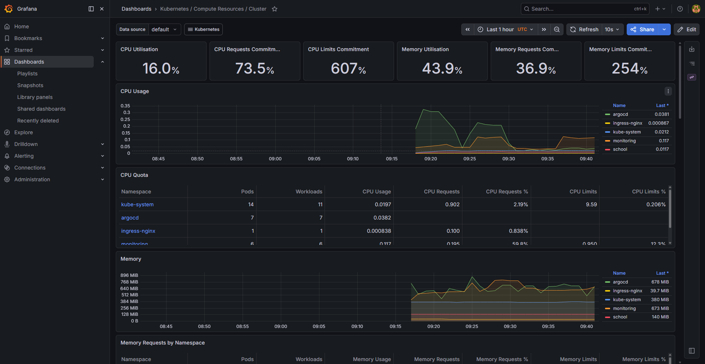
*Grafana — Compute Resources / Cluster: CPU & memory across all namespaces.*

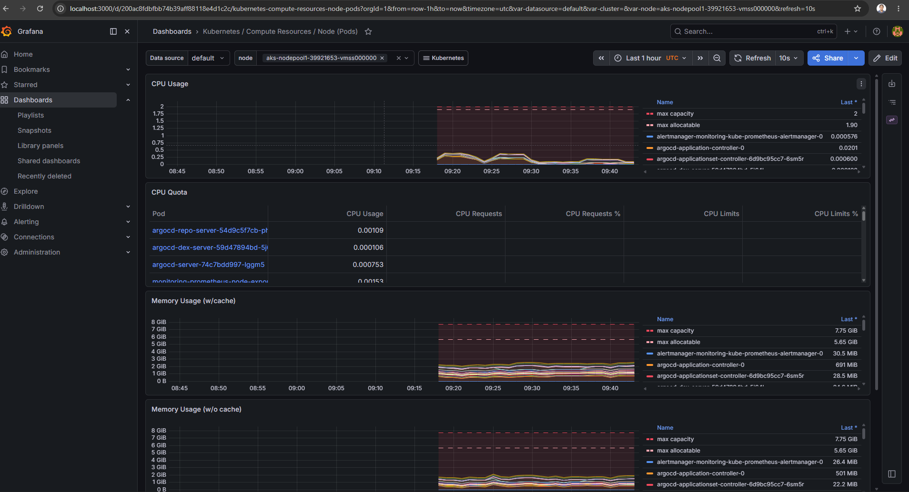
*Grafana — Compute Resources / Node (Pods): per-pod usage on the node.*

---

## Frontend (Flutter web)

The Flutter web client (a separate project) is hosted on an **Azure Storage
static website** — no compute/VM quota required, free HTTPS endpoint.

```bash
flutter build web --release
az storage blob upload-batch \
  --account-name <account> -s build/web -d '$web' --overwrite
```

The app reads its API base URL at runtime from a bundled `.env`
(`API_BASE_URL=https://<LB-IP>.nip.io/api`), so it can be repointed without a
rebuild. The backend's `CORS_ALLOWED_ORIGINS` (env-driven, set in the ConfigMap)
must include the frontend's origin.

> Serve the frontend over **HTTPS** to match the HTTPS backend — an HTTPS page
> calling an HTTP API is blocked by browsers as *mixed content*.

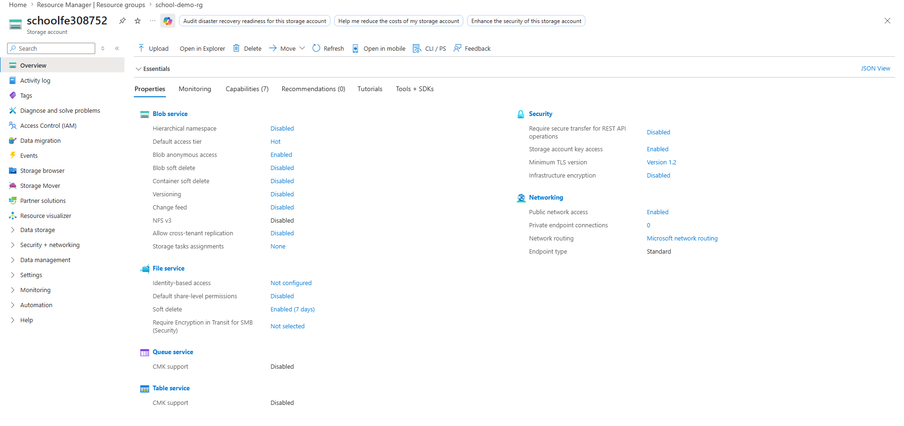
*The frontend storage account hosting the static website (`$web` container).*

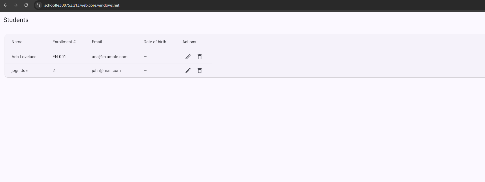
*The Flutter web app — students list, served from the storage static website and reading the API over HTTPS.*

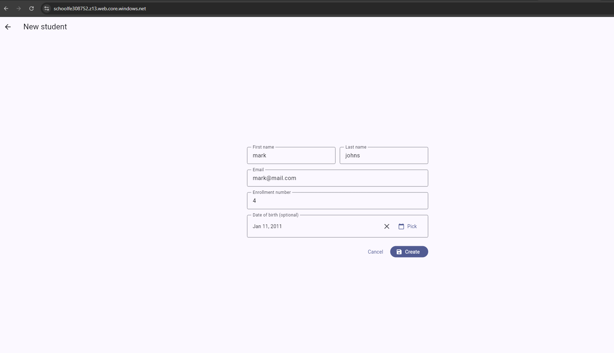
*Creating a student from the frontend (POST `/api/students/`).*

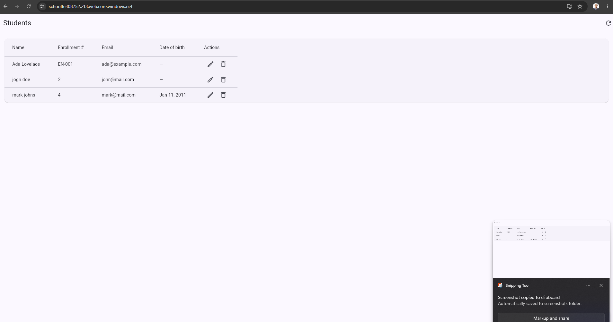
*The list reflecting newly created students — full CRUD working end-to-end over HTTPS.*

---

## Configuration (environment variables)

Read in [core/settings.py](core/settings.py):

| Var | Notes |
|---|---|
| `SECRET_KEY` | required, no default |
| `DEBUG` | default `False` |
| `ALLOWED_HOSTS` | comma-separated |
| `CSRF_TRUSTED_ORIGINS` | comma-separated, scheme required |
| `CORS_ALLOWED_ORIGINS` | comma-separated frontend origins (scheme, no trailing slash) |
| `POSTGRES_DB/_USER/_PASSWORD/_HOST/_PORT` | DB connection |

`.env` is git-ignored; `.env.example` is the template.

---

## Teardown (AKS demo)

```bash
az group delete -n school-demo-rg --yes --no-wait
```

Deletes the cluster, its node resource group, the LoadBalancer, public IP, disks,
and the frontend storage account in one call.
